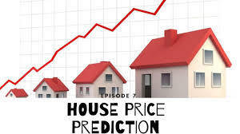
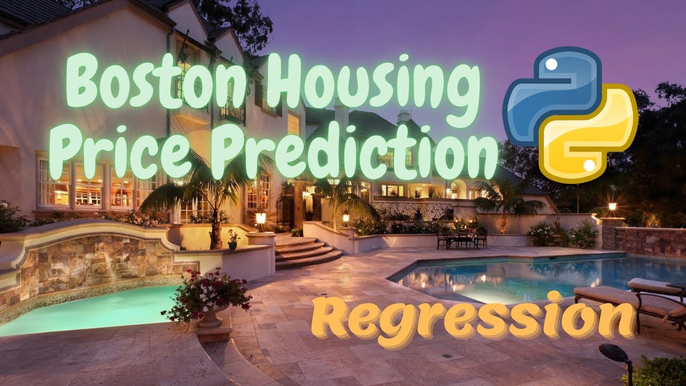

 
  

<h1 align="center"> Boston-house-price-prediction </h1>

 

<h2> :floppy_disk: Project Files Description</h2>

This Project includes 1 colab notebook, 1 technical documentation as well as 1 presentation:

<h4>Executable Files:</h4>
<ul>
  <li><b>Boston-house-price-prediction.ipynb</b> - Includes all functions required for regression operations.</li>
</ul>

<h4>Output:</h4>
<ul>
  <li><b>Google Colab</b> - All the outputs are visible in the provided colab notebook.
</ul>
<h4>Input Files:</h4>
<ul>
  <li><b>Boston-house-price-prediction.csv</b> - Input dataset having information about Boston house price.</li>
</ul>
<h4>Data Source:</h4>
Load the dataset from sklearn 

<h2> :book:Dataset Information</h2>
The Boston Housing Dataset consists of the price of houses in various places in Boston. The dataset provides information such as Crime (CRIM), areas of non-retail business in the town (INDUS), the age of people who own the house (AGE), and many other attributes also, have a glimpse of the data

<h2> :book: Problem Statement</h2>
Project Description You want to be the best real estate agent out there. In order to compete with other agents in your area, you decide to use machine learning. You are going to use various statistical analysis tools to build the best model to predict the value of a given house. Your task is to find the best price your client can sell their house at. The best guess from a model is one that best generalizes the data.

<h2> :book: Data Summery</h2>
There are 506 observations in our data and 15 features with no categorial one. Once we get a good fit, we will use this model to predict the monetary value of a house located at Boston’s area. The data is also available scikit-learn, we can import it right away from the scikit-learn itself. Let's get started by importing some python libraries here..

Data Columns -

- CRIM     per capita crime rate by town
- ZN       proportion of residential land zoned for lots over 25,000 sq.ft.
- INDUS    proportion of non-retail business acres per town
- CHAS     Charles River dummy variable (= 1 if tract bounds river; 0 otherwise)
- NOX      nitric oxides concentration (parts per 10 million)
- RM       average number of rooms per dwelling
- AGE      proportion of owner-occupied units built prior to 1940
- DIS      weighted distances to five Boston employment centres
- RAD      index of accessibility to radial highways
- TAX      full-value property-tax rate per $10,000
- PTRATIO  pupil-teacher ratio by town
- B        1000(Bk - 0.63)^2 where Bk is the proportion of blacks by town
- LSTAT    % lower status of the population
- MEDV     Median value of owner-occupied homes in $1000's

# Web App Flask:

<h2>:website:https://boston-house-price-predictio.herokuapp.com/
  
 

# Conclusion
The accuracy 60.44% is not that good but sufficient enough for a beginner to understand how regression works, suggestions and feedback to modify the code to get higher accuracy are appreciated.

